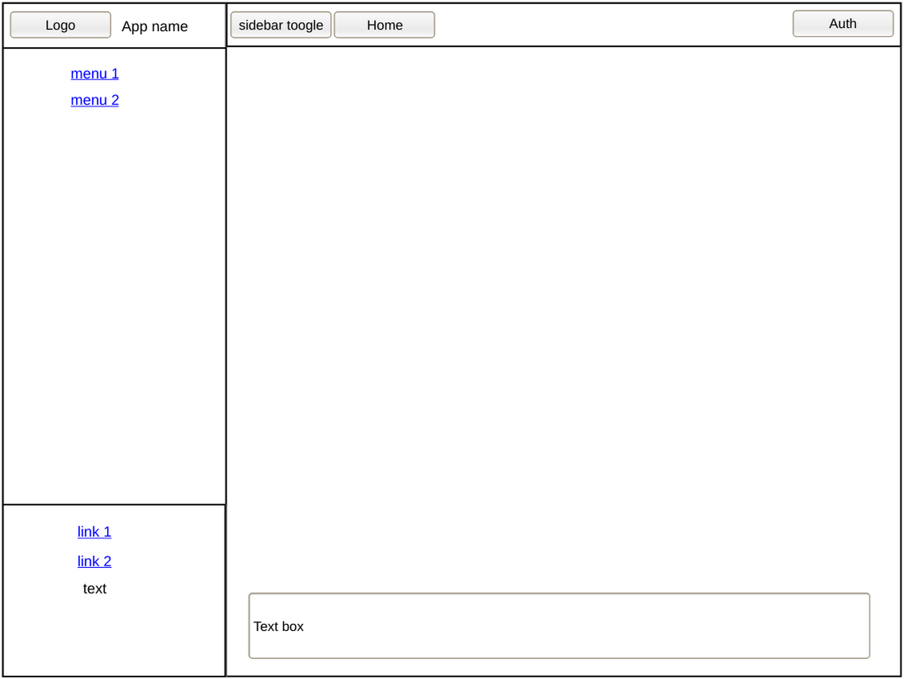
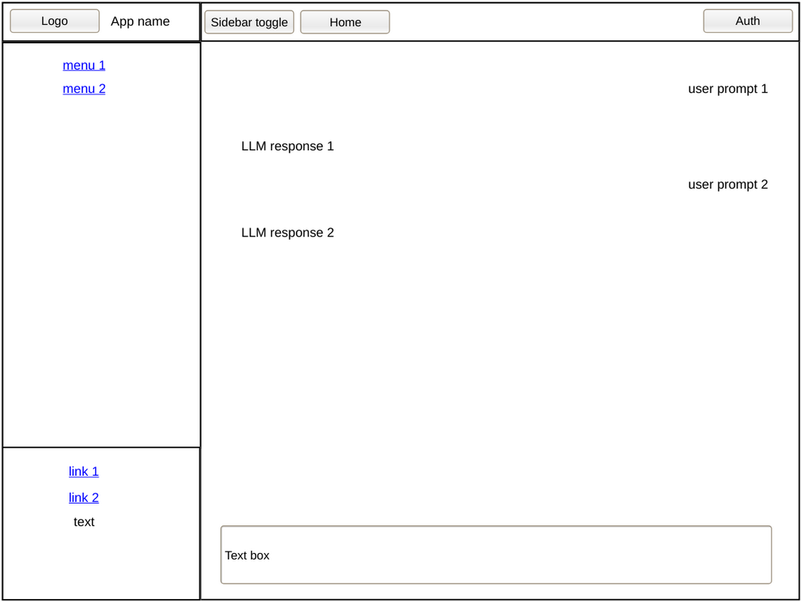
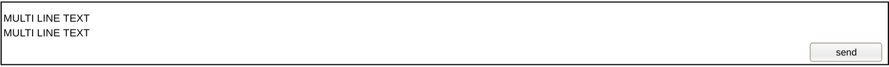

# [index.html](../../../core/src/main/resources/templates/index.html)

## Tech

- **CSS:** DaisyUI [default components](https://daisyui.com/components/) wherever possible + Tailwind/custom CSS when
  needed
- **JS/Frameworks:** [HTMX strict CSP](../../../core/src/main/resources/templates/fragments/head.html), Alpine.js/CSP (
  no evals, no inline event handlers)
- **Icons:** [heroicons](https://heroicons.com/)
- **Other:**
  - Project uses TS and Thymeleaf — treat as normal HTML when designing
  - If something can't be achieved with default DaisyUI components, simplify the design instead

## Mockups

### on load

Page is composed of 2 sections:

- sidebar
- main

#### sidebar

Visible on mid to large screens, collapses on mobile. Uses DaisyUI drawer, toggle label lives outside the drawer (in the
navbar).

Sidebar has 3 sections:

- top section
- middle section
- bottom section

##### top section

- no outline
- width full to parent
- height auto to content
- contains app icon (placeholder heroicon) + app name, left-aligned

##### middle section

- width full to parent
- height: fills remaining space after bottom section
- no outline
- nav links, each centered

##### bottom section

- top outline
- width full to parent
- height auto to content
- single column, items centered
- contains links, settings, and status info

#### main

Main has 3 sections:

- top section
- content section
- form section

##### top section

- navbar
- sticky
- no outline
- bottom small shadow
- width full to parent
- height auto to content
- 2 columns:
  - left: sidebar toggle (icon button, small) + home link (icon button, small)
  - right: auth button (icon button, small)

##### content section

User interaction and server response area.

- width full to parent
- height: fills remaining screen space, `overflow-y: auto`
- no auto-scroll

Empty on first load.

###### content section after server responses

After each interaction:

- user prompt appended, right-aligned
- LLM response appended left-aligned, below its prompt
- responses stream via SSE, chunks are appended as they arrive; view does not auto-scroll to follow the stream
- session only, no history

Interaction flow:

1. user submits prompt → prompt immediately appended to layout
2. spinner appears (see form section)
3. SSE stream begins, response chunks appended as they arrive
4. stream ends → spinner hidden

> **Implementation note (v1):** server endpoint is a dummy SSE controller returning hardcoded chunks with a small delay. Swap for the real LLM endpoint when ready.

##### form section

- sticky, always at bottom
- centered, full width to parent (with padding)
- textarea: height grows with content up to a maximum, then scrolls internally
- spinner: right-aligned, directly above the form; appears on submit, hidden when stream ends; does not overlay the
  textarea
